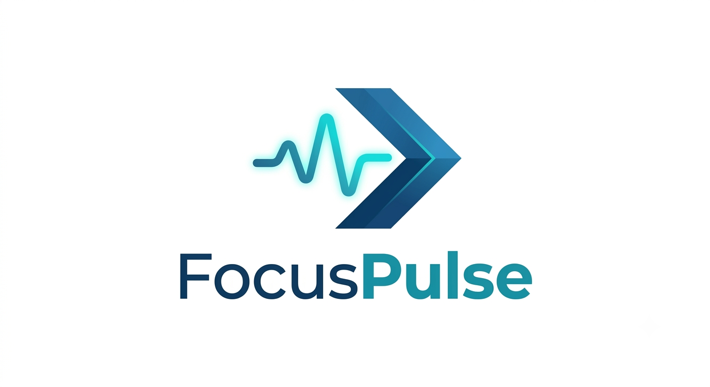

<p align="center">
  
</p>

<h1 align="center">🎯 FocusPulse</h1>

<p align="center">
  <strong>Tu copiloto de productividad que te ayuda a reconquistar tu tiempo, una pestaña a la vez.</strong>
</p>

<p align="center">
  
  
  
  
</p>

---

## 💡 Inspiración / El Problema

Los desarrolladores perdemos un promedio de **2.5 horas diarias** en distracciones digitales sin siquiera darnos cuenta. Abrimos YouTube "solo un minuto", revisamos Twitter "rápido" y cuando miramos el reloj, se fue media tarde.

**FocusPulse** nació para combatir esto: no con culpa ni restricciones agresivas, sino con datos reales, gamificación inteligente y un asistente de IA local que te guía sin juzgarte.

---

## ✨ Funcionalidades Clave

### 🚫 Modo Enfoque (Focus Mode)
Activa un bloqueo de 25 minutos estilo Pomodoro. Los sitios de distracción (YouTube, Twitter, Instagram, Netflix...) se redirigen automáticamente a una pantalla de "¡Vuelve al trabajo!". Al terminar, recibís una notificación nativa de Chrome.

### 🛡️ Sistema Anti-Trampas
Usa `chrome.idle` con un umbral de 3 minutos para detectar inactividad real. Si te levantas del escritorio o dejás de interactuar, **el cronómetro se pausa**. Solo cuenta tiempo de trabajo genuino.

### 🏆 Gamificación
- **🥇 Racha de Foco**: Se desbloquea al superar 2 horas en sitios productivos.
- **🧘 Mente Zen**: Se desbloquea si las redes sociales representan menos del 10% de tu navegación.
- Insignias bloqueadas muestran barra de progreso para motivarte a alcanzarlas.

### 📊 Metas y Límites Diarios
Definí tu meta de productividad (ej: 4h en código) y tu límite de distracciones (ej: 1h en redes). Barras de progreso en vivo con alerta visual cuando alcanzás el límite.

### 🤖 Consejo de IA Local
Usa la **Prompt API del navegador** (`window.ai`) para generar consejos de productividad personalizados basados en tus datos reales. Todo se procesa localmente, sin enviar datos a la nube.

### 🔔 Alertas Inteligentes
Si llevás más de 20 minutos continuos en un sitio de distracción, recibís una notificación nativa amigable: *"¿Volvemos al flujo?"* — solo una vez por sesión para no hacer spam.

---

## 🛠️ Tech Stack

| Capa | Tecnología |
|------|-----------|
| 🧩 Extensión | Chrome Extensions API (Manifest V3), JavaScript Vanilla |
| ⚙️ Backend | Python, FastAPI, Uvicorn |
| 🎨 Dashboard | HTML5, Tailwind CSS (CDN), Chart.js |
| 🔐 Auth | Google OAuth2 (Identity Services + chrome.identity) |
| 🤖 IA | Chrome Built-in AI (window.ai / Prompt API) |

---

## 🚀 Instalación Rápida

### 1. Backend (FastAPI)

```bash
cd backend
pip install -r requirements.txt
uvicorn main:app --reload --port 8000
```

El servidor arranca en `http://127.0.0.1:8000/`.
El dashboard web se abre automáticamente en la raíz.

### 2. Dashboard Web

Una vez levantado el backend, abrí en tu navegador:

```
http://127.0.0.1:8000/
```

Iniciá sesión con Google y listo.

### 3. Extensión de Chrome

1. Abrí `chrome://extensions/` en tu navegador.
2. Activá el **Modo desarrollador** (esquina superior derecha).
3. Clic en **"Cargar descomprimida"**.
4. Seleccioná la carpeta `/extension` del proyecto.
5. Clic en el icono de FocusPulse en la barra de extensiones.
6. Iniciá sesión con Google desde el popup.

---

## 📁 Estructura del Proyecto

```
focuspulse/
├── backend/
│   ├── main.py              # API FastAPI + servidor de archivos estáticos
│   └── requirements.txt     # Dependencias Python
├── dashboard/
│   ├── index.html           # UI principal (login + dashboard)
│   ├── app.js               # Lógica: auth, charts, metas, IA
│   └── assets/icons/        # Logos e iconos para la web
├── extension/
│   ├── manifest.json        # Config Manifest V3
│   ├── background.js        # Service worker (tracking + bloqueo)
│   ├── popup.html           # Interfaz del popup
│   ├── popup.js             # Auth + Modo Enfoque
│   ├── blocked.html         # Página de bloqueo
│   └── assets/icons/        # Logos e iconos de la extensión
└── README.md
```

---

## 👤 Créditos

Creado por **Franco Leone** — 2026.

---

<p align="center">
  <em>"No se trata de trabajar más horas, sino de hacer que cada hora cuente."</em>
</p>
